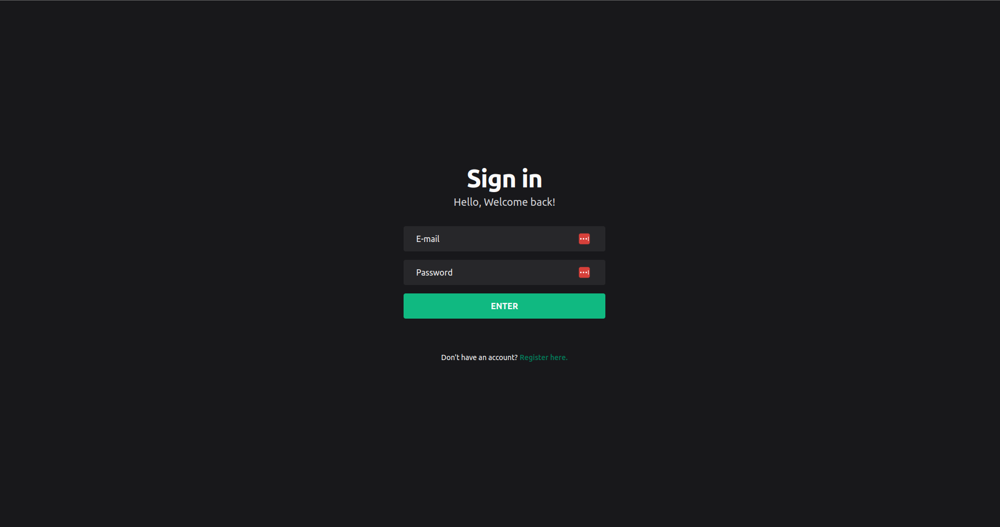
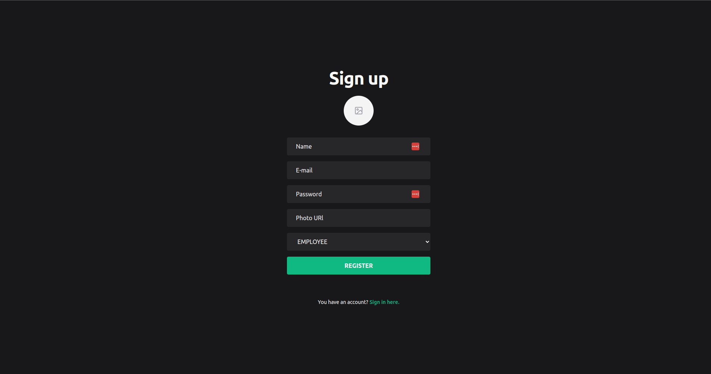
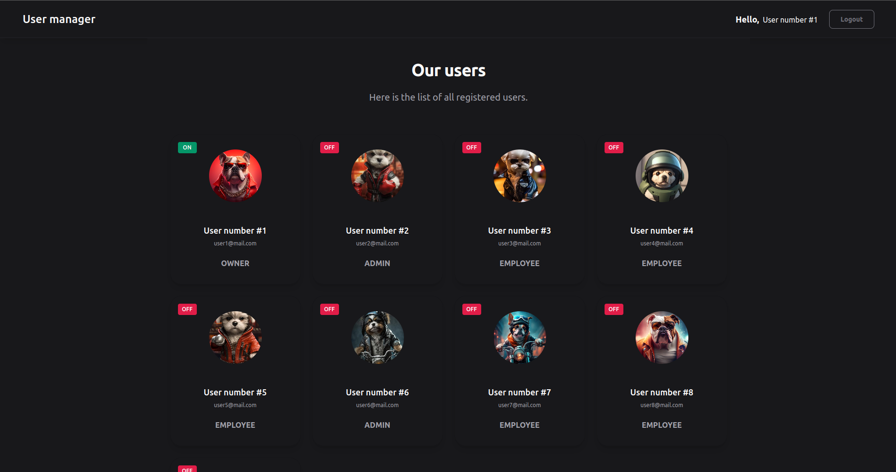
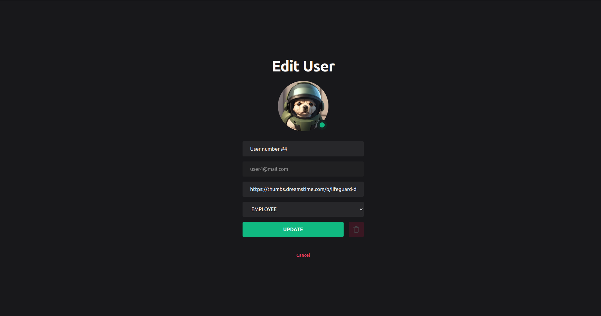
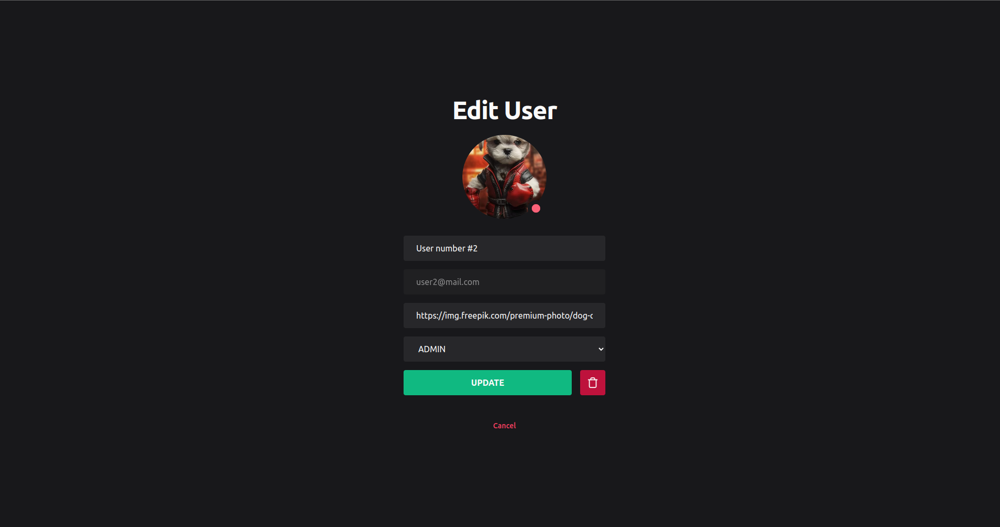
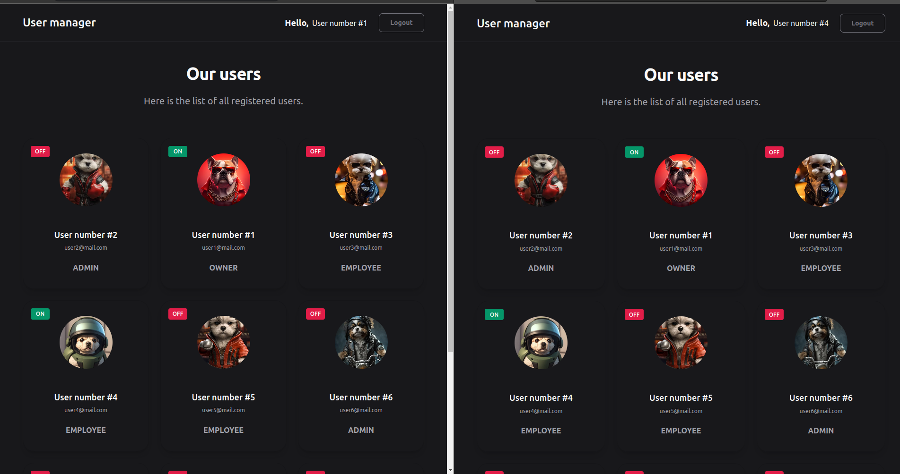

<h1 align="center">

USER MANAGER

</h1>
 
 
  

    
    
  

  

    
    
  

  

    
    
  

 
 
 

Project test to at Tallos, using VueJS + Tailwind + Typescript

  

### Getting started

- You need installed Docker and Docker Compose in Container or running in local.

- Also need to clone the backend project from [user-manager-server](https://github.com/evandersondev/user-manager-server).

- In your terminal, run the steps:

> `pnpm install` **for install the modules**.

> `pnpm dev`. **for running docker and up web app**.

> You can access in your browser the web application http://localhost:8080/.

## Features

Features used in the Project.

- **<a href="https://vuejs.org/" target="_blank">VueJS</a>**

- **<a href="https://tailwindcss.com/" target="\_blank">TailwindCSS</a>**

- **<a href="https://www.docker.com/" target="_blank">Docker</a>**

- **<a href="https://vue3-toastify.js-bridge.com/" target="_blank">Vue3 Toastify</a>**

- **<a href="https://www.typescriptlang.org/" target="_blank">TypeScript</a>**

- **<a href="https://vuex.vuejs.org/" target="_blank">VueX</a>**

- **<a href="https://lucide.dev/" target="_blank">Lucide Icons</a>**

- **<a href="https://router.vuejs.org/" target="_blank">Vue Router</a>**

- **<a href="https://socket.io/" target="_blank">Socket IO</a>**

### - LICENSE

This project is licensed under the MIT License - see the <a href="https://opensource.org/licenses/MIT" target="_blank">LICENSE</a> page for details.
